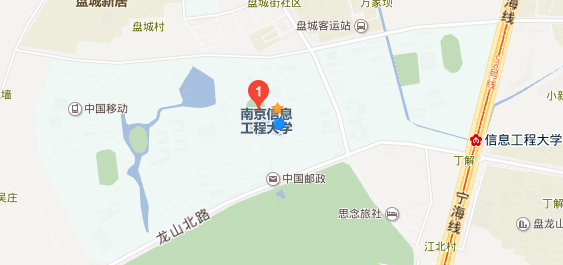
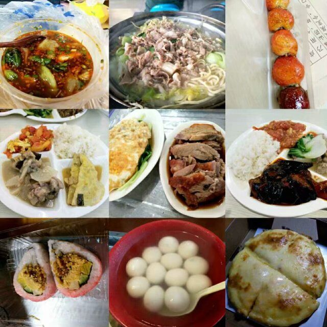
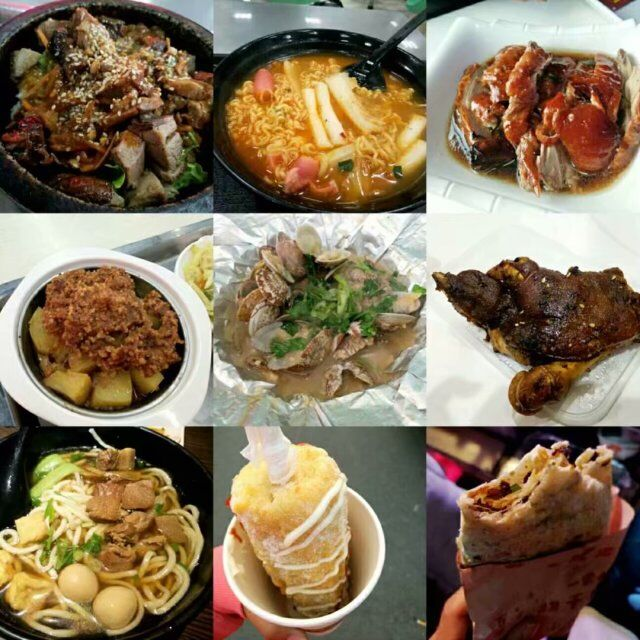
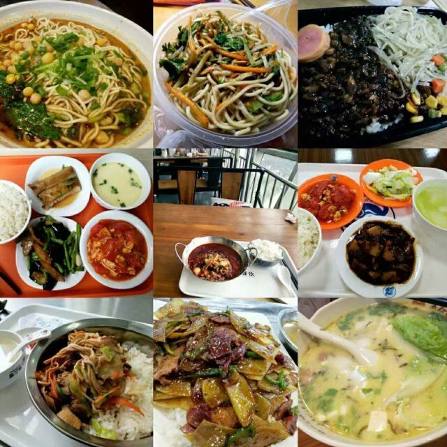

南京信息工程大学2018级计软院新生小贴士
============================

>   本文主要针对目前群里提到的所有问题做一统一回复。希望对大家有所帮助
~~其实只是不想一遍又一遍的回答~~

本小贴士针对2018级计软院新生，版权所有。转载请声明出处。

### **顺便给猫头群猪宣传一波群**

[点击链接加入群聊【2018南信大计软新生群】](https://jq.qq.com/?_wv=1027&k=5OWlG8G)

**作者：cc**
**时间：2018.7.5**
**版本：1.1.1**

---
---
# 常见问题索引

* [学校地理位置](#学校地理位置)

* [消费水平配套设施](#消费水平配套设施)

* [关于宿舍](#关于宿舍)
    
    * [几人间](#几人间)

    * [宿舍怎么分](#宿舍怎么分)

    * [洗衣机](#洗衣机)

    * [生活及饮用水](#生活及饮用水)

    * [洗澡](#洗澡)

    * [空调](#空调)

    * [关于电费及电器](#关于电费及电器)

    * [停电断网情况](#停电断网情况)

* [关于教室](#关于教室)

* [吃的咋样](#吃的咋样)

* [关于电脑](#关于电脑)

    * [学校大一是否允许带电脑](#学校大一是否允许带电脑)

    * [关于电脑的选购](#关于电脑的选购)

* [学校社团](#学校社团)

* [军训](#军训)

* [问题尚未解决怎么办](#问题尚未解决怎么办)

----
----
# 常见问题
>## 学校地理位置

学校位于南京市浦口区宁六路219号。校门口就是江北快速大道及地铁线S8。就交通来说是极为便利的。（学校另有花旗营小区，及现在在无锡新开的滨江学院校区，由于作者本人不熟悉所以在此不多做描述）

* 学校到市中心
    
    （这里市中心我们以新街口为标准，学校出发点以地铁站为标准，即不计算从各宿舍出发去地铁站的时间）
    
    大约需要四十分钟的时间，地铁转乘3次
    
    （S8号线 -> 3号线 -> 2号线）
    （S8号线 -> 3号线 -> 1号线）
    
    ---
* 南京站到学校
    
    （这里测试标准同上）
    
    大约需要半小时的时间，地铁转乘两次
    
    （S8号线 -> 3号线）

    ----
* 南京南站到学校
    
    （这里测试标准同上）
    
    大约需要接近一小时的时间，地铁转乘3次
    
    （S8号线 -> 3号线 -> 1号线）
---
>## 消费水平配套设施
    
由于地处浦口区，物价水平低于城区。（这里不讨论生活费，因为每个人需求，消费水平因人而异，有人800元一月，也有人2500一月）

``周围配套设施完善：``
    
* 购物中心电影院等大型商圈：有地铁几站路之隔的弘扬广场，还有隔壁六合区的各种大型商场

* 医院有社区服务站及江北人民医院

* 学校附近网吧，ktv，小吃，小超市小店应有尽有。

    未完待续。。。

 **总结：其实作为一所综合大学，拥有上万人口的密集地区，这些配套设施怎么可能没有呢（对于商家来说这可都是钱啊）所以学弟学妹们大可不用担心。**

---
>## 关于宿舍

* ### 几人间
    
    >2017年我们伟大的校长大人李北群宣布要让所有学子都住上四人间。

    ``学校目前在建的宿舍大概有两处（作者没有具体统计）
    一处位于西苑（原滨江校区）一处位于中苑。预计今年暑假可以完工。而且暑期学校貌似有计划翻修几处宿舍给新生使用。
    宿舍保守估计应该都是四人间，只有是否有独卫及阳台还是要看脸哦~``

    ---
* ### 宿舍怎么分

    ``宿舍由学校划分派片区给各个学院，再由学院各专业负责的老师抓阄分配。``~~所以还是看脸啊~~

    ``专业内部按学号划分宿舍，即一个宿舍都是学号连续的。学号按姓名笔划划分。``

    ---
* ### 洗衣机
    
    ``每个宿舍楼都有几台公共洗衣机，使用学校的学生卡（即饭卡）刷卡付费使用，一次三元``

    不过个人感觉···公共洗衣机是极其脏的，不是很建议使用。贴身衣物还是自己洗比较健康~

    ---
* ### 生活及饮用水
    
    ``宿舍楼里每个楼层都有打水机器。在手机上下载app充值即可使用。按出水量计价，冷热水价格不同，热水更高。
    但是其实问题不大，感觉冲十块钱可以用好久好久。``
    
    ``PS：某些打水机器是带有净水机效果的（一般这种打水机位于一楼），另外教学楼也用同种机器作为直饮水来源``

    ---
* ### 洗澡

    ``排除有独卫，有热水器的宿舍。公共浴室也是一个一个的小隔间组成的淋浴间``
    
    **不是某些同学担心的大澡堂!!!**
    
    ``洗澡也是要付钱的~使用学生卡刷卡按时间计费（而且一旦刷卡开始洗澡，中间关水也是会继续扣费的）一次预扣费4元，洗完后再刷卡一次停止付费，把未使用的预付费部分刷回来。4元最多可洗20多分钟。``
    
    ~~一般情况下洗一次澡基本在2元左右？~~
    （咳咳，个人情况，因人而异···）

    ---
* ### 空调

    **每个宿舍都有空调！**
    **每个宿舍都有空调！**
    **每个宿舍都有空调！**

    重复三遍~
    
    ``空调是租赁的，开学付完租金之后既可以使用。``
    **电费自付，想怎么开就怎么开！**
    ``（毕业会退空调租金貌似~我还没毕业我也不知道~~~）``

    ---
* ### 关于电费及电器

    * 电费
    
         ``
        电费学校貌似每个学期都会有一定的免费额度，只有在这个免费额度用完之后才需要自己缴纳电费（交电费也是靠app!）
        ``

    * 电器

        **学校宿舍禁止使用大功率电器，如电锅，电热毯，热得快等**

        ``如果你不想被宿管阿姨查水表的，如果你不想被没收装别的话还请自重。（部分宿舍电路承受能力强，有的宿舍可能大功率的一接入就跳闸，所以啊~宿舍看脸2333）``

        ``嗯，吹风机貌似不算违规电器，但是建议买个功率小一点的，把宿舍楼整跳闸了可不好~ o(*￣▽￣*)ブ``

        ``被没收的电器可以在学期期末，或者毕业后凭凭证去对应地点取回``
    
    **各种校组织会定期检查宿舍违规电器使用情况**

    
    ---
* ### 停电断网情况

    > 本部分补充自“猫头群主”的Issues(啪啪啪啪~此处应有掌声)

    * 夏季(大概从5月底开始) 不断电
    
    * 冬季 23:30(工作日) 23:50(周末) 左右开始断电 (除了空调插座)
    
        ---

    * ipv4网 晚上 23:50 左右开始中断
    
    * ipv6网 不断的 (但据说现在晚上也开始断了 还没考证)

    **以上中断 均在 次日 7点 恢复**

    **温馨提示：**
    **尽量少熬夜，等你工作了有的是时间熬夜（想不熬都不行）
    如果要熬夜的话，请确保你开热点消耗的流量在套餐范围内（足够的流量）**

---
>## 关于教室

**很不幸的告诉大家，教室没有空调~ㄟ( ▔, ▔ )ㄏ**

**对，你没看错，就是没有！**

*其实我校雷丁学院的教室好像是有空调的，但是人家学费也高不是~*

**~~Σ(っ °Д °;)っ南京四大火炉之一你告诉我教室没有空调？！！~~**

* 小插曲

    ``之前美的的官博好像爆出过一张图，貌似是我校教室空调项目的竞标~(￣▽￣)~*至于有没有后文我就不知道了哈``

---
>## 吃的咋样
    
    
``学校目前有六个食堂。周围一大把的小吃街（虽然拆迁拆了一条，不过问题不大）``
    
面包，面条，各种包子，粥，豆浆，各类炒饭，鸭血粉丝（金陵一绝~~好吧学校的不算特别正宗~~）
    
披萨，咖喱饭，蛋包饭，焗饭，薯条，汉堡，炸鸡

盖浇饭，黄焖鸡，酸菜鱼，铁板饭，重庆小面

烤鱼，烤肉，烤鸭，撸串串

······

还有啥，暂时想不起来了(*^▽^*)，放点图自己领会~

*以下图片有的是食堂的，也有的是外卖，还有的是周边的商圈的（我是从某群顺来哒(～￣▽￣)～）反正都是在学校可以吃到的，至于怎么吃到，需要你发挥一颗吃货的心！也欢迎咨询某群吃货担当*

---

*9图流~（还有好多没有放出来呢）*

---
>## 关于电脑

* ### 学校大一是否允许带电脑

    ~~作为一个计软院的学生怎么能够不带电脑呢？？？？~~

    **学校明令规定大一新生不允许带电脑!!!!**

    **不准带电脑**

    **不准带电脑**

    **不准带电脑**

    **学校会有专门人员定期检查**

    ~~官方叫我这么说的~~

    

    *欢迎私戳深入关于电脑了解~看我眼神，你懂我意思吧*

    ---
* ### 关于电脑的选购

    > 相信一定会有学弟学妹问，作为一个计软院的学子
    ~~一个未来臭搬砖的码农~~我是否需要一个性能极其优秀的电脑呢？？？
    那么我们这里就来讨♂论一下冠以电脑选购。

    （这里就不做电脑推荐了，只是简单说明一下电脑的需求要素，后面可能会甩几个推荐链接~~也省得推荐不好被学弟学妹骂~~如果没有链接大概是没找到合适的···）

    * 码农的性能需求：

         你以为作为一个码农电脑就一定要超级好了吗？gtx1080起步？酷睿i9走起？抱歉这样的标准是游戏本······然而我们是敲代码的。

            码农的笔记本电脑一般要求的是运行流畅，以及处理器性能的优异，能够多开任务以及充分的便携性续航能力。所以，游戏本完全pass！！！

            然而游戏本因为其独立显卡的存在（耗电大户）以及对散热设计的要求（暴力风扇散热大户+1 大体积设计笨重+1），续航，轻便完全不符合要求。

        码农笔记本需求：
        
        * 轻薄便携续航能力强，机身质量控制在2.5kg左右（或者更少），续航能力在10h左右

        * 处理器能力优秀，有一个好的cpu。内存足够大，满足运行大型软件需求。响应速度快，SSD(固态走起)

        * 如果没有特殊的职业需求（例如涉及到图形处理，渲染等的工作）抛弃独立显卡以求高续航轻便性。

    **然而我懂你的，大学生嘛，怎么不可能玩个游戏呢**
    
    

    ----

    * **真正适合你的电脑性能属性**

        * 机身建议选择轻便一点的（如果你还是考虑一下便携性的话）
        
            机身质量3kg左右（相信我5kg的机身重量会让你背着觉得怀疑人生）    

        * 照顾游戏性能，独立显卡必须的！10系列显卡（现在基本的起步）

        * 内存尽量大一点，有条件的话8g起步。固态硬盘，有条件的话也是必须的

        * 待补充
    
    **总结：**
    -------

    相信大家的需求肯定还是以后者为主（这里我当然相信学弟学妹有大佬已经以第一个需求标准要求自己了）所以总的来说买个较为轻薄的游戏本就可以。基本可以照顾到你大学的所有需求。
---
>## 学校社团

* 学校有超级多超级多超级多的社团~~没有具体统计过~~

    舞蹈，歌唱，书法，绘画，汉服，手语，天文，地理，篮球    ，羽毛球，乒乓球，台球······

    好多好多呢b（￣▽￣）d　

    ~~欸嘿，还真没有官方电竞社~~
    
    ~~打什么游戏好好学习！~~

    这个到了开学军训结束之后的百团大战大家自然会了解哈！这里就不赘述了

    

---
>## 军训

* Above all

    军训时间段内不允许使用手机（如果你不怕被教官怼的话）

    **最重要的事情：**

    **军训不要随便拍照！**

    **不要随便拍照！**
    **不要随便拍照！**
    **不要随便拍照！**

    **这是会涉及军队保密条例的（严肃脸）**

* 时间

    ``学校军训时间大概为期半个月``

* 地点

    ``就在本校啦``
    
    ``我大计软院应该还是在吃土操场？``

* 人物

    ``别看了，就决定是你了``
    
    ``教官是南京军区某军校专业教官，保证给你训的服服帖帖的233``

    ~~终于轮到我们在旁边吃瓜看你们军训啦，喔哈哈哈啊哈~~

    咳咳，这段掐掉,导演~

* Something else

    ``军训期间身体原因不适合高强度训练是可以申请加入“保健班”，他们那边轻松点~``

---
>## 问题尚未解决怎么办

* 如果以上小贴士还没能解决你的问题，请在本项目Issues反馈

    [Github Issues](https://github.com/needhourger/nuist_README/issues)

* 也欢迎加入猫头群主的群深入♂交流(/▽＼)

* 没啦~