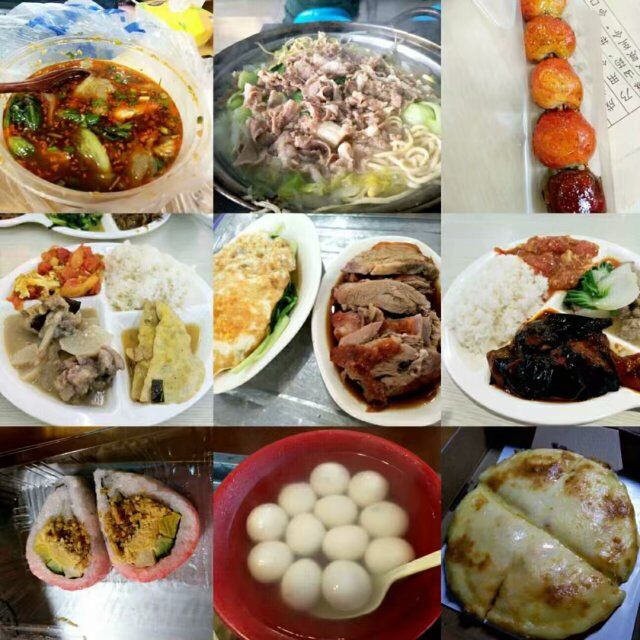
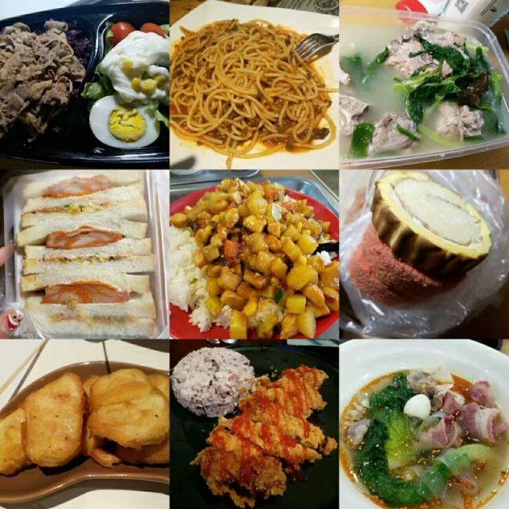
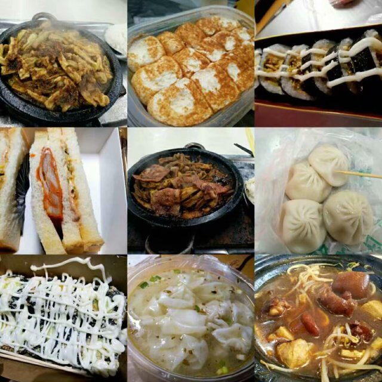
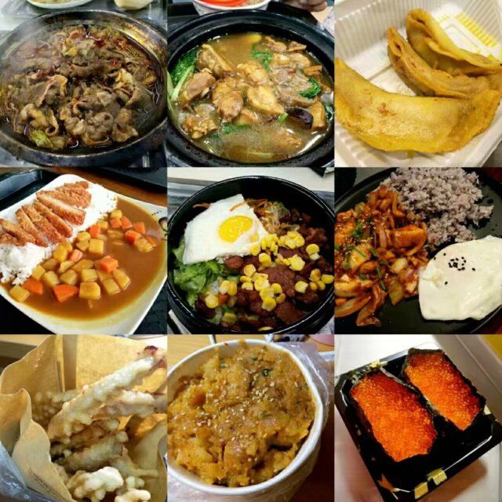
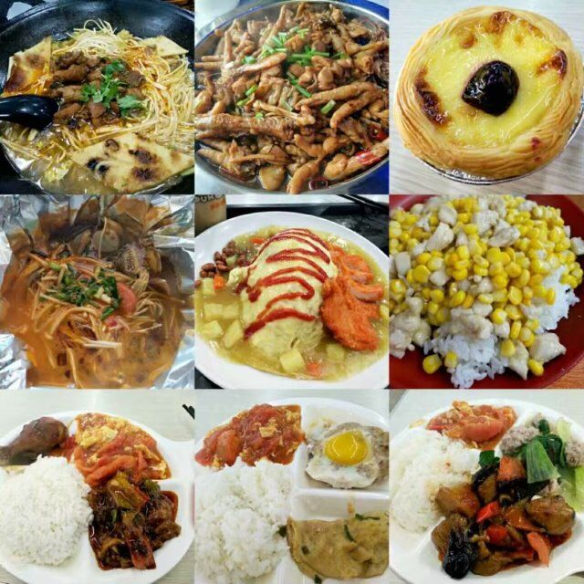

吃在学校
=======

---
> # 常见问题索引

* [概述](#概述)

* [食堂地理位置分布](#食堂地理位置分布)

* [支付方式](#支付方式)

---    
># 概述
    
``学校目前有六个食堂。周围一大把的小吃街（虽然拆迁拆了一条，不过问题不大）``
    
面包，面条，各种包子，粥，豆浆，各类炒饭，鸭血粉丝（金陵一绝~~好吧学校的不算特别正宗~~）
    
披萨，咖喱饭，蛋包饭，焗饭，薯条，汉堡，炸鸡

盖浇饭，黄焖鸡，酸菜鱼，铁板饭，重庆小面

烤鱼，烤肉，烤鸭，撸串串

······

还有啥，暂时想不起来了(*^▽^*)，放点图自己领会~

*以下图片有的是食堂的，也有的是外卖，还有的是周边的商圈的（我是从某群顺来哒(～￣▽￣)～）反正都是在学校可以吃到的，至于怎么吃到，需要你发挥一颗吃货的心！也欢迎咨询某群吃货担当*

---

*9图流~（还有好多没有放出来呢）*

---
># 食堂地理位置分布

食堂名称|层数|特色
:-------:|:----:|:----
东苑新食堂|3|3楼颜值极高，环境很棒，有很多外国小哥哥小姐姐哦
中苑老食堂|2|价格实惠便宜，一楼有空调，二楼没有（热爆！）
中苑新食堂|3|有电视可以看，3楼有空调
西苑老食堂|2|翻新过，环境也不赖
西苑新食堂|3|emmmmmmmm~~编不出来了~~
教师食堂1960|2|（中午不可以）晚上对学生开放

># 支付方式

* 消费方式
    * 刷学生卡
    * 刷支付宝学生卡（需要绑定学校）
    * 直接刷支付宝
    * 微信
    * 现金

    **PS：以上支付方式以优先级降序排列**
* 价格：平价适中，10元够好吃，20元够精致,30您是土豪了，我们做朋友吧~

