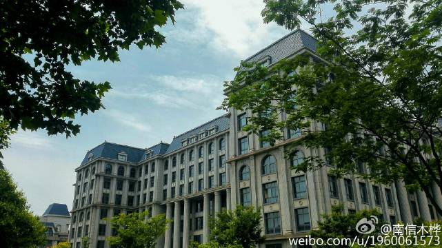

关于图书馆
========

># 常见问题索引
* [图书馆概述](#图书馆概述)

* [图书馆开放时间](#图书馆开放时间)

* [馆舍布局](#馆舍布局)

* [借阅规则](#借阅规则)

---
---
* >## 图书馆概述
    图书馆凭一卡通进门和借阅书籍，藏书众多，并可凭卡借阅。
    图书馆夏季(全校最凉快的区域，请自备厚衣保暖)和冬季都有空调。

    平时坐得很疏松，期末时占座问题就会变得极其严重，要想有个好好的复习环境就要早起。

    PS:各个教学楼的教室、社团活动场所，也可以作为自习教室哦（就是没空调(っ °Д °;)っ）。
---
* >## 图书馆开放时间

    动作|时间
    :---:|:---:
    开门|7:30
    各功能区开门（电子阅览室等）|8:00
    闭馆|10:00

* >## 馆舍布局

    
功能区 | 服务项目 | 服务时间
:--: | :----: | :----
一楼大厅总服务台 | 纸质文献的借还 | 每天8：00-22：00
一楼大厅总服务台 | 充值、缴费、借阅证的办理、挂失等；读者咨询 | 周一至周五:8:00-12:00 ;13:30-16:30
一楼东电子阅览室 | 电子资源的查询、阅读、下载、上网等 | 每天8:00-22:00
一楼西多媒体阅览室 | 电子资源的查询、阅读、下载、上网等 | 每天8:00-22:00
二楼东语言文化借阅处 | 中图法分类号G、H语言文化类图书借阅 | 每天8:00-22:00
二楼北工科借阅处1 | 中图法分类号T-TN6工科类图书借阅 | 每天8:00-22:00
二楼西工科借阅处2 | 中图法分类号TN7-TP工科类图书借阅 | 每天8:00-22:00
二楼南工科借阅处3 | 中图法分类号TQ-TV工科类图书借阅 | 每天8:00-22:00
二楼西南光盘借阅处 | 随书光盘借阅服务；复印服务 | 周一至周五： 8:00-12:00 ; 13:30-16:30
三楼东理科借阅处 | 中图法分类号N、O、Q、R、S、U、V、Z自科类图书借阅 | 每天8:00-22:00
三楼北气象环境借阅处 | 中图法分类号P、X 气象环境类图书借阅 | 每天8:00-22:00
三楼南特色图书陈列室（暂名） | 该校教师、校友的著作及赠书 | 筹建中
三楼西文学借阅处 | 中图法分类号I文学类图书借阅 | 每天8:00-22:00
四楼西自然科学期刊阅览室 | 自然科学现刊、过刊阅览；该室现刊不外借 | 每天8:00-22:00
四楼北外文过刊阅览室 | 外文过刊阅览 | 每天8:00-22:00
四楼东北气象资料阅览室 | 气象资料阅览（天气图不外借） | 每天8:00-22:00
四楼东社会科学期刊阅览室 | 社会科学现刊、过刊、报纸阅览；（现刊不外借） | 每天8:00-22:00
四楼南报刊阅览室 | 报刊阅览（现刊不外借） | 每天8:00-22:00
五楼东文科借阅处1 | 中图法分类号C、D、K社科类图书 | 每天8:00-22:00
五楼西文科借阅处2 | 中图法分类号A、B、E、F社科类图书 | 每天8:00-22:00
五楼南艺术图书借阅处 | 中图法分类号J艺术类图书 | 每天8:00-22:00
五楼北培训室 | 读者培训服务（内容见每周培训表） | 周一至周五： 8:00-12:00 ;13:30-16:30
五楼北放映厅 | 多媒体资源放映服务（内容见每周 播放表） | 周一至周五： 8:00-12:00 ; 13:30-16:30
六楼南外文图书借阅处 | 外文图书 | 每天8:00-22:00
六楼东科图法图书借阅处 | 科图法图书 | 每天8:00-22:00
六楼西自科图书阅览室 | 中图法分类号N—Z自科类图书的阅览（图书不外借） | 每天8:00-22:00
六楼北信息服务室 | 科技查新服务;代查代检服务;参考咨询服务;原文传递服务;读者定题服务 | 周一至周五： 8:00-12:00;13:30-16:30
六楼北资源数字化室 | 技术服务；资源数字化服务 | 周一至周五： 8:00-12:00;13:30-16:30
七楼东社科图书阅览室1 | 中图法分类号A-H社科类图书的阅览（图书不外借） | 每天8:00-22:00
七楼北社科图书阅览室2 | 中图法分类号I，J，K社科类图书的阅览（图书不外借） | 每天8:00-22:00
七楼西北工具书阅览室 | 各类工具书的阅览（图书不外借） | 每天8:00-22:00
七楼西南特色样本阅览室 | 大气、环境特色样本书和科图法样本书的阅览（图书不外借） | 每天8:00-22:00
图书馆网站 | 馆藏电子资源的查询、阅读、下载、文献信息服务、参考咨询、网络导航、宣传育人、文化推广、,互动交流、站内导航、行政业务交流、业务统计等 | 每天24小时

---
* >## 借阅规则
    1. 凡该校教职工、学生一律凭本人校园卡向本馆借阅规定限额的图书。
    2. 借阅期限：教职工、研究生读者为2个月，本科学生读者为1个月。到期应还的图书，如确实需要，又无他人预借登记，可办理续借手续一次，续借期：教职工、研究生读者为30天，本、专科读者为15天。
    3. 借书总限额：教职工可借阅各种图书15册，研究生读者为12册，本科学生读者为8册。其中外文图书教职工、研究生读者可借阅4册，本科学生读者可借阅2册。
    4. 本馆出借以各借书处普通图书为限，各阅览室图书仅供馆内阅读，概不外借。
    5. 读者所借图书，必须如期归还。逾期不还者，中文图书逾期，每册每天收取逾期占用费0.1元，外文图书逾期，每册每天收取逾期占用费0.2元。凡在节假日及寒暑假期间到期的图书，借期将延至开学日后7天（以学生正式上课日为开学日）；法定假期间（如五一、十一）到期的图书，借期将延至正常上班日后3天。
    6. 本馆对借出图书，遇有必要时，可提前收回。读者收到提前催还通知单时，应立即归还。
    7. 读者应妥善保管、爱护所借图书，如有涂改、刮损、缺页、遗失，按《南京信息工程大学图书馆读者损坏遗失书刊资料赔偿办法》处理。个别情节特别严重者，除按章赔偿外，并报请有关部门处理。
    8. 读者调离学校、出国；退学、转学或毕业离校，应将所借书刊资料还清，并作注销处理，否则不得办理离校手续。
    9. 如因特殊需要，需临时集体借书，应由专人负责，持学院证明，来本馆办理集体借书手续，用完后集体归还。逾期不还，按章对负责人收取逾期占用费。如有损坏或遗失由借阅者负责按章赔偿。